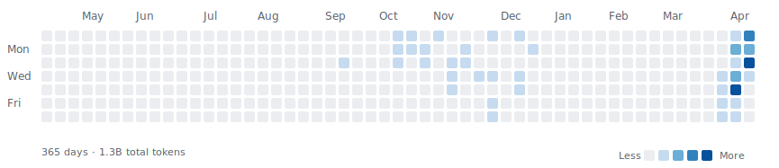

# Hi, I'm 宇宙熊YZX

Building with AI tools, shipping small experiments, and keeping things practical.

Focused on things that are actually useful: resume tooling, research agents, and RAG systems.

## Current Projects

- [chat-resume](https://chatresume.tech) - AI resume optimization and mock interview platform.
- [open-deep-research](https://rsgpt.vercel.app) - Deep research agent for planning, search, analysis, and report generation.
- [Yzx Wiki](https://yzxwiki.vercel.app) - My personal llm wiki website
- [token-heatmap](https://github.com/849261680/token-heatmap) - CLI for turning Codex and Claude Code usage logs into a GitHub-style token heatmap.
- [DocPal](https://ragsys.vercel.app) - RAG enterprise knowledge base Q&A system.

## Elsewhere

- Website: [pengshixiong.com](https://www.pengshixiong.com)

## Token Heatmap

Data source: [`849261680/token-heatmap`](https://github.com/849261680/token-heatmap)

<!-- tokenheat-sync: 2026-04-17T00:05:00+08:00 -->
